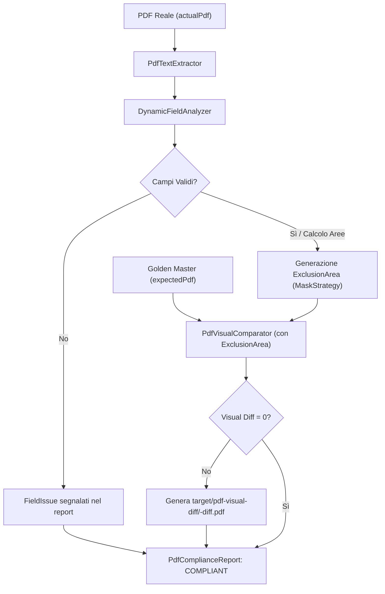

# Guida Tecnica al Visual Regression Testing dei Documenti PDF (SEND / PagoPA)

## Indice
1. [Introduzione e Obiettivi](#introduzione-e-obiettivi)
2. [Architettura a Due Livelli](#architettura-a-due-livelli)
3. [Funzionamento del Motore Ibrido](#funzionamento-del-motore-ibrido)
4. [I Documenti Supportati (11 Template)](#i-documenti-supportati-11-template)
5. [Guida Passo-Passo: Aggiungere un Nuovo Template](#guida-passo-passo-aggiungere-un-nuovo-template)
6. [Gestione dei Golden Master (`expected.pdf`)](#gestione-dei-golden-master-expectedpdf)
7. [Interpretazione dei Diff Visivi e Risoluzione Errori](#interpretazione-dei-diff-visivi-e-risoluzione-errori)
8. [Esecuzione Test e Integrazione CI/CD](#esecuzione-test-e-integrazione-cicd)

---

## 1. Introduzione e Obiettivi

Nel sistema **SEND (Piattaforma Notifiche PagoPA)**, i documenti PDF prodotti (come le attestazioni opponibili a terzi, avvisi di avvenuta ricezione, comunicazioni bonarie, ecc.) hanno valore legale e devono rispettare layout tipografici rigorosi, normative di accessibilità e formati specifici dei metadati.

Il framework di **Visual Regression Testing (VRT)** garantisce che:
1. **Campi dinamici** (IUN, Codici Fiscali, date, ore, indirizzi PEC) siano presenti nella corretta posizione e rispettino i pattern di validazione SEND.
2. **Layout visivo** (font, margini, loghi, tabelle, posizionamento) rimanga invariato a livello di pixel rispetto al *Golden Master* (`expected.pdf`), prevenendo regressioni grafiche indesiderate.

---

## 2. Architettura a Due Livelli

Il framework adotta una rigorosa separazione delle responsabilità tra libreria comune e modulo di dominio:

```
┌────────────────────────────────────────────────────────────────────────┐
│  common (it.pagopa.common.pdf.visualtest.*)                           │
│  • Totalmente agnostico rispetto al dominio SEND                       │
│  • PdfTextExtractor (Apache PDFBox 3.0.x, estrazione coordinate/box)   │
│  • FieldLocators & FieldValidators (ricerca posizionale, regex, etc.) │
│  • MaskStrategy (mascheramento dinamico pre-confronto visivo)         │
│  • PdfVisualComparator (integrazione de.redsix:pdfcompare 1.2.8)       │
│  • PdfComplianceChecker, PdfComplianceReport, DocumentTemplateRegistry│
└────────────────────────────────────┬───────────────────────────────────┘
                                     │ dipende da
┌────────────────────────────────────▼───────────────────────────────────┐
│  pn-b2bclient (it.pagopa.pn.cucumber.steps.visualtest.*)               │
│  • SendFieldValidators (pattern IUN, CF PF/PG, PEC, data/ora SEND)     │
│  • Templates Java (SenderAckTemplate, PecDeliveryTemplate, ...)        │
│  • PdfVisualTestConfiguration (Spring Bean DocumentTemplateRegistry)   │
│  • PdfVisualRegressionSteps (Step Gherkin Cucumber per test E2E/smoke) │
│  • Golden Master Resources (expected-pdfs/<template-key>/expected.pdf) │
└────────────────────────────────────────────────────────────────────────┘
```

### Regole Architetturali Fondamentali
- **Nessuna dipendenza SEND in `common`:** `common` non fa menzione di IUN, Legal Fact, protocolli o logiche di PagoPA.
- **Isolamento PDFBox:** Nessun tipo nativo di PDFBox (`PDDocument`, `TextPosition`) deve trapelare nelle firme pubbliche del modulo `common`.
- **Nessuna reinvenzione in `pn-b2bclient`:** Il modulo di test usa esclusivamente le API esposte da `common`.

---

## 3. Funzionamento del Motore Ibrido

Il processo di verifica segue il flusso:



1. **Estrazione e Analisi Dinamica:** Viene estratto il testo con le relative coordinate per pagina. Per ogni campo registrato nel template, il locator individua la porzione di testo e il validatore ne controlla il formato.
2. **Mascheramento Intelligente:** Per ciascun campo individuato viene calcolata un'area di esclusione (bounding box con padding) secondo la `MaskStrategy` configurata (`TIGHT_BOX` o `FULL_LINE`).
3. **Confronto Visivo:** `PdfVisualComparator` confronta `expected.pdf` e `actualPdf` escludendo dal confronto pixel solo le coordinate dinamiche variabili, garantendo zero falsi positivi su data, ora e IUN.

### 3.1 Verifica Testuale Esplicita per Destinatario (`contains`)

Oltre al confronto pixel-level e alla validazione di formato dei campi dinamici, è disponibile un terzo livello di verifica, utile quando il valore atteso di un campo è **già noto allo scenario Gherkin** (es. il nome del destinatario appena creato).

Per i documenti dove un blocco di campi (nome, codice fiscale, domicilio digitale, ...) **si ripete una volta per ciascun destinatario** (notifiche multidestinatario), è disponibile uno step con `DataTable` che riusa direttamente `FieldLocators.labelProximityOccurrence` (variante di `labelProximity` già usato nei template): per ogni riga della tabella, cerca l'etichetta indicata in `campo` e ne prende la N-esima occorrenza nel documento, dove N è l'indice del destinatario passato allo step (1-based).

```gherkin
Then per il destinatario 1 del PDF si verificano i seguenti campi
  | campo                             | valore           |
  | Nome e Cognome / Ragione Sociale  | Mario Gherkin    |
  | Codice Fiscale                    | BRGLRZ80D58H501Q |
  | Domicilio digitale                | prova@pec.it     |

Then per il destinatario 2 del PDF si verificano i seguenti campi
  | campo                             | valore           |
  | Nome e Cognome / Ragione Sociale  | Luigi Cucumber   |
```

`campo` deve corrispondere al testo dell'etichetta così come appare nel PDF (es. `Nome e Cognome / Ragione Sociale`, `Codice Fiscale`, `Domicilio digitale`, `Tipologia di domicilio digitale`); `valore` è il testo atteso, verificato come sottostringa del valore trovato.

Lo step opera sull'ultimo PDF scaricato/generato (`lastDownloadedPdf`), quindi va eseguito dopo uno step che lo renda disponibile (es. `si verifica la conformità visiva...` o `si verificano i campi dinamici...`).

---

## 4. I Documenti Supportati (11 Template)

I seguenti template sono registrati in `PdfVisualTestConfiguration`:

| # | Classe Template | Chiave Registry | Cartella Golden Master | Descrizione Documento |
|---|----------------|-----------------|------------------------|-----------------------|
| 1 | `SenderAckTemplate` | `SENDER_ACK` | `sender-ack` | Attestazione notifica presa in carico |
| 2 | `PecDeliveryTemplate` | `PEC_DELIVERY` | `pec-delivery` | Avvenuta ricezione digitale (PEC) |
| 3 | `NotificationViewedTemplate` | `NOTIFICATION_VIEWED` | `notification-viewed` | Attestato avvenuto accesso destinatario |
| 4 | `AnalogFailureTemplate` | `ANALOG_FAILURE` | `analog-failure` | Mancato recapito analogico |
| 5 | `NotificationCancelledTemplate` | `NOTIFICATION_CANCELLED` | `notification-cancelled` | Dichiarazione annullamento notifica |
| 6 | `MalfunctionTemplate` | `MALFUNCTION` | `malfunction` | Attestazione disservizio / ripristino |
| 7 | `AnalogDeliveryWorkflowTimeoutLegalFactTemplate` | `ANALOG_DELIVERY_WORKFLOW_TIMEOUT_LEGAL_FACT` | `analog-delivery-workflow-timeout-legal-fact` | Mancato recapito per decorrenza termini |
| 8 | `NotificationAarTemplate` | `NOTIFICATION_AAR` | `notification-aar` | Avviso di Avvenuta Ricezione standard |
| 9 | `NotificationAarRaddAltTemplate` | `NOTIFICATION_AAR_RADD_ALT` | `notification-aar-radd-alt` | Avviso Ricezione RADD Alternativo |
| 10 | `AnalogFeedbackAvailabilityStatementTemplate` | `ANALOG_FEEDBACK_AVAILABILITY_STATEMENT` | `analog-feedback-availability-statement` | Attestazione disponibilità feedback |
| 11 | `InformalAnalogCommunicationTemplate` | `INFORMAL_ANALOG_COMMUNICATION` | `informal-analog-communication` | Comunicazione bonaria cartacea |

---

## 5. Guida Passo-Passo: Aggiungere un Nuovo Template

Per aggiungere il supporto a un 12° documento (es. `NuovoLegalFactTemplate`):

### Passo 1: Creare la classe del Template
Crea `NuovoLegalFactTemplate.java` in `src/test/java/it/pagopa/pn/cucumber/steps/visualtest/templates/`:
```java
package it.pagopa.pn.cucumber.steps.visualtest.templates;

import it.pagopa.common.pdf.visualtest.FieldLocators;
import it.pagopa.common.pdf.visualtest.MaskStrategy;
import it.pagopa.common.pdf.visualtest.PdfDocumentTemplate;
import it.pagopa.pn.cucumber.steps.visualtest.SendFieldValidators;
import static it.pagopa.common.pdf.visualtest.FieldValidators.present;

public final class NuovoLegalFactTemplate {

    public static final String KEY = "NUOVO_LEGAL_FACT";

    private NuovoLegalFactTemplate() {}

    public static PdfDocumentTemplate build() {
        return PdfDocumentTemplate.builder(KEY)
                .field("IUN",
                        FieldLocators.labelProximity("IUN", 300f, 15f),
                        SendFieldValidators.iun(),
                        MaskStrategy.TIGHT_BOX)
                .field("Codice Fiscale",
                        FieldLocators.labelProximity("Codice fiscale", 250f, 15f),
                        present(),
                        MaskStrategy.TIGHT_BOX)
                .field("Data",
                        FieldLocators.labelProximity("data", 200f, 20f),
                        SendFieldValidators.dataItaliana(),
                        MaskStrategy.FULL_LINE)
                .build();
    }
}
```

### Passo 2: Registrare il Template in `PdfVisualTestConfiguration`
Aggiungi il nuovo template in `PdfVisualTestConfiguration.java`:
```java
@Bean
public DocumentTemplateRegistry documentTemplateRegistry() {
    return DocumentTemplateRegistry.builder()
            // ... altri template ...
            .register(NuovoLegalFactTemplate.build())
            .build();
}
```

### Passo 3: Creare la cartella delle Risorse Golden Master
Crea la cartella:
```
src/test/resources/it/pagopa/pn/cucumber/visualtest/expected-pdfs/nuovo-legal-fact/
```
con un file `README.md` esplicativo e predisposto per ospitare `expected.pdf`.

### Passo 4: Aggiungere gli Scenari Cucumber
In `src/test/resources/it/pagopa/pn/cucumber/visualTest/PdfVisualRegression.feature`:
```gherkin
  @visualTest @nuovoLegalFact @smoke
  Scenario: [VRT-13-SMOKE] Verifica solo campi dinamici di NuovoLegalFact (smoke)
    Given ...
    When ...
    Then si verificano i campi dinamici del PDF con il template "NUOVO_LEGAL_FACT"

  @visualTest @nuovoLegalFact
  Scenario: [VRT-13] Verifica visual regression di NuovoLegalFact
    Given ...
    When ...
    Then si verifica la conformità visiva del PDF con il template "NUOVO_LEGAL_FACT"
```

---

## 6. Gestione dei Golden Master (`expected.pdf`)

### Quando creare o aggiornare un `expected.pdf`:
1. **Primo rollout:** Quando si aggiunge un nuovo template.
2. **Modifica intenzionale del layout:** Quando PagoPA rilascia un aggiornamento grafico concordato (es. nuovo footer istituzionale, cambio font, variazione margini legali).

### Procedura di acquisizione Golden Master:
1. Esegui lo scenario con tag `@smoke` del documento prescelto su un **ambiente di test stabile e certificato**.
2. Verifica visivamente che il PDF prodotto sia conforme ai requisiti grafici approvati.
3. Posiziona il PDF nella cartella corrispondente rinominandolo `expected.pdf`:
   ```
   src/test/resources/it/pagopa/pn/cucumber/visualtest/expected-pdfs/<kebab-case-key>/expected.pdf
   ```
4. Esegui lo scenario completo senza tag `@smoke` per confermare che il test passi (`BUILD SUCCESS`).
5. Esegui il commit di `expected.pdf` nel repository Git.

---

## 7. Interpretazione dei Diff Visivi e Risoluzione Errori

Quando un test fallisce, l'eccezione riporta in dettaglio la causa del disallineamento:

### Caso A: Fallimento nei Campi Dinamici (`FieldIssue`)
```
java.lang.AssertionError:
Report di conformità PDF per template 'SENDER_ACK': FAIL
Problemi nei campi dinamici:
  • Campo 'IUN': valore trovato '1234' non rispetta il formato IUN SEND (es. YDKG-AHTX-KRKA-202502-N-1)
  • Campo 'Data emissione': etichetta 'data' non trovata nella pagina
```
**Cosa fare:**
- Verificare se il backend ha alterato la formattazione del campo.
- Verificare se l'etichetta di prossimità nel template ha cambiato dicitura (es. "Data di emissione" invece di "data").

### Caso B: Differenza Visiva Pixel (`Visual Differences`)
```
java.lang.AssertionError:
Report di conformità PDF per template 'SENDER_ACK': FAIL
Differenze visive rilevate: differenze a livello di pixel su pagina 1
Diff salvato in: target/pdf-visual-diff/sender_ack-diff.pdf
```
**Cosa fare:**
- Aprire il PDF di diff generato in `target/pdf-visual-diff/<template>-diff.pdf`.
- `pdfcompare` evidenzia in **rosso** i pixel presenti solo nell'expected e in **verde** i pixel presenti solo nell'actual.
- Se la differenza è dovuta a un campo dinamico non mascherato, ampliare la bounding box o cambiare la strategia in `MaskStrategy.FULL_LINE`.
- Se la differenza è una modifica voluta di layout, aggiornare `expected.pdf`.

---

## 8. Esecuzione Test e Integrazione CI/CD

### Eseguire solo i controlli sui campi dinamici (senza golden master):
```powershell
.\mvnw.cmd test -Dtest=PdfVisualRegressionTest -Dcucumber.filter.tags="@smoke"
```

### Eseguire l'intera suite di regressione visiva:
```powershell
.\mvnw.cmd test -Dtest=PdfVisualRegressionTest
```

### Eseguire un singolo template:
```powershell
.\mvnw.cmd test -Dtest=PdfVisualRegressionTest -Dcucumber.filter.tags="@senderAck"
```
